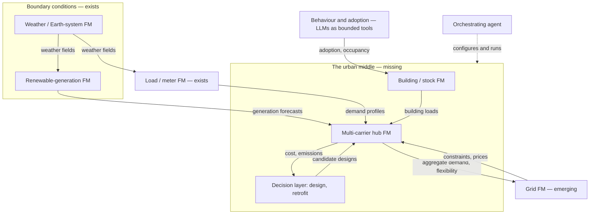

# 4.11 Putting It Together: A Future Ecosystem of UES Foundation Models
{: .no_toc }



The rest of this chapter surveys directions one at a time. This page asks how they would fit together — which models, built on which [basic elements](../appendices/a-glossary.html#basic-element), passing what to each other.
{: .fs-6 .fw-300 }

1. TOC
{:toc}

---

## Why an ecosystem, not a model

The argument of [§2.3](../chapter-2-fm-foundations/2-3-choosing-a-basic-element.html) is that a [foundation model](../appendices/a-glossary.html#foundation-model) works where its basic element suits the object it models. The existing energy FMs bear that out: grid FMs are built on the bus, meter FMs on a load time series, renewable-generation FMs on a generation site, weather FMs on a cell of a physical field ([§2.4](../chapter-2-fm-foundations/2-4-existing-fms-relevant-to-energy.html)). These elements differ, and nothing in this book suggests one element will serve all of them. So a future urban energy system is more likely to be served by **several foundation models, each on its own element, connected at interfaces**, than by one.

This page is the book's own synthesis, not a survey of one. A dated search (arXiv title/abstract, run 29 September 2026) combining "foundation model" with "ecosystem" and "energy" or "grid" returns 11 results, none about coupling energy-system foundation models; combining "foundation model(s)" with "coupling", "interoperab\*" or "composable" and "power system" or "energy system" returns one unrelated result.

## The components, by layer

| Layer | Component | Basic element | Status | In this book |
| :--- | :--- | :--- | :--- | :--- |
| Boundary conditions | Weather and Earth-system FMs; geospatial FMs | Cell of a physical field; satellite [patch](../appendices/a-glossary.html#patch) | Mature not yet fused with UES data | [§2.4.5](../chapter-2-fm-foundations/2-4-5-geospatial-weather-fms.html) |
| Boundary conditions | Renewable-generation FMs | Generation site | Mature | [§2.4.3](../chapter-2-fm-foundations/2-4-3-clean-energy-forecasting-fms.html) |
| Demand | Meter / load FMs; general time-series FMs [zero-shot](../appendices/a-glossary.html#zero-shot) | Load time series | Mature | [§2.4.1](../chapter-2-fm-foundations/2-4-1-time-series-fms.html), [§2.4.2](../chapter-2-fm-foundations/2-4-2-power-grid-fms.html), [§4.1](4-1-off-the-shelf-fms.html) |
| Buildings and stocks | Simulator-grounded building FM; stock-level FM | Not settled ([G8](../chapter-6-outlook/6-1-open-gaps.html#g8)) | None yet | [§4.2](4-2-fms-for-building-stocks.html), [§4.8](4-8-candidate-subfields.html) |
| Multi-carrier conversion | Hub / district FM | Not yet defined | None yet | [Chapter 5](../chapter-5-case-study/index.html) |
| Grid | Grid FM | Bus | Emerging | [§2.4.2](../chapter-2-fm-foundations/2-4-2-power-grid-fms.html) |
| Decisions | Amortised design, retrofit, generative design | [Decision space](../appendices/a-glossary.html#decision-space) ([G9](../chapter-6-outlook/6-1-open-gaps.html#g9)) | Early single-system [surrogates](../appendices/a-glossary.html#surrogate) only | [§4.4](4-4-generative-design.html), [§4.9.3](4-9-3-methods-tier3.html), [§3.9](../chapter-3-sim-opt/3-9-retrofit-and-whole-life-carbon.html) |
| People | Behaviour and adoption | No simulator of people | Early LLMs as bounded tools | [§3.10](../chapter-3-sim-opt/3-10-social-dimensions.html), [§4.3](4-3-llm-agents-for-simulation.html) |
| Orchestration | Agents that configure and run models | Language and tool calls | Early verification open ([G7](../chapter-6-outlook/6-1-open-gaps.html#g7)) | [§4.3](4-3-llm-agents-for-simulation.html) |
| Infrastructure | Data engines, schemas, benchmarks | — | Emerging grid side only | [§3.7](../chapter-3-sim-opt/3-7-schemas-and-standards.html), [G4](../chapter-6-outlook/6-1-open-gaps.html#g4) |

Status scale: Mature working models exist and are in use · Emerging first domain models exist · Early only partial or single-case attempts · None yet nothing built yet.
{: .fs-2 }

Read down the status column and the shape of the problem is plain: **the ends exist and the middle does not.** Boundary conditions, demand and grid each have working models. The layers where urban energy systems are actually urban — buildings, multi-carrier conversion, decisions, people — have no settled element, no model, or no simulator.

## What passes between them

An ecosystem is defined less by its models than by its interfaces. Three kinds are available, and they trade off in the same way:

| Interface | What passes | Gains | Costs |
| :--- | :--- | :--- | :--- |
| **Physical quantities** | Profiles, forecasts, boundary conditions, flexibility envelopes, prices | Each model validated on its own; interface checkable in physical units; components replaceable | Information is lost at the interface; errors compound along the chain |
| **Shared learned representations** | Embeddings, or models trained jointly | Can carry what no physical quantity summarises | Components stop being separately verifiable or replaceable; needs training data spanning both sides |
| **Language and tool calls** | Requests, configurations, results | Flexible; the interface people will use | Every silently chosen assumption needs checking ([G7](../chapter-6-outlook/6-1-open-gaps.html#g7)) |

The first is what coupled tools do today. [Co-simulation](../appendices/a-glossary.html#co-simulation) — separate sub-models exchanging data at a coupling interface — is an established practice for buildings and smart energy systems, with its own taxonomic review ([§3.6](../chapter-3-sim-opt/3-6-tool-landscape.html)).[^alfalouji2023cosimulation] A learned ecosystem coupled by physical quantities is that practice with learned components substituted in, which is why it is the most reachable form. The second is the "genuinely novel scientific claim" of the case study's [Phase 5](../chapter-5-case-study/5-1-roadmap.html#phase-5-year-610--multi-scale-coupling) and the open architectural question of the grid-load bridge in [§4.8](4-8-candidate-subfields.html): whether two components built on different basic elements can share a representation at all.

The specific interfaces a UES ecosystem would need, and what stands behind each today:

| From → to | What passes | Today |
| :--- | :--- | :--- |
| Weather FM → load or renewable FM | Weather fields as covariates | Covariate handling in time-series FMs is uneven and under-verified ([§2.4.1](../chapter-2-fm-foundations/2-4-1-time-series-fms.html)) |
| Load / renewable FM → hub | Demand and generation forecasts — ideally as distributions, not points | Standard boundary conditions for dispatch ([§2.4.3](../chapter-2-fm-foundations/2-4-3-clean-energy-forecasting-fms.html)) |
| Hub → grid | Aggregate demand; flexibility envelope (D5 in [§5.7](../chapter-5-case-study/5-7-module-decomposition.html)) | Hand-passed between separate tools |
| Grid → hub | Network constraints; nodal prices | Hand-passed between separate tools |
| Behaviour / adoption → buildings | Adoption rates, occupancy schedules | [Agent-based models](../appendices/a-glossary.html#agent-based-model-abm) and occupant agents ([§3.10](../chapter-3-sim-opt/3-10-social-dimensions.html)) |
| Hub ↔ decisions | Candidate designs out; cost and emissions back | Single-system surrogates in the loop ([§4.9.3](4-9-3-methods-tier3.html)) |

## Three shapes it could take

**1. One [multimodal](../appendices/a-glossary.html#multimodality) UES foundation model.** A single model with an encoder per modality — demand, weather, technology, topology, market — trained jointly: the case study's encoder stack ([§5.7](../chapter-5-case-study/5-7-module-decomposition.html)) extended to everything. The precedent is Earth-system modelling, where one foundation model trained on more than a million hours of diverse geophysical data outperforms operational forecasts in air quality, ocean waves, tropical-cyclone tracks and high-resolution weather, and can be fine-tuned for new applications at modest cost.[^bodnar2025aurora] What makes that possible is exactly what UES lacks: every one of those tasks is posed on the same kind of element, a cell of a physical field on a shared grid. UES layers do not share an element (bus, meter series, building, hub). This shape is therefore conditional on the central open problem of this book being solved, not an alternative to solving it.

**2. A federation of specialist FMs coupled through physical interfaces.** Each layer keeps the element that suits it, and models exchange physical quantities as co-simulated tools do now. This is the shape the field is already drifting into by default — load, grid and weather FMs are maturing separately. Its weakness is the interface: what a forecast drops (its uncertainty, its covariance with other forecasts) never reaches the model downstream, and errors from each component stack.

**3. An agent orchestrating specialist FMs and conventional simulators.** A language model plans the task and calls the right models and tools. The closest working precedent is in computational chemistry: an agentic framework uses LLMs for task planning and scientific reasoning while calling graph-network foundation models and conventional methods up to density functional theory, evaluated on 13 benchmark tasks; smaller LLMs handled simple workflows, complex ones benefited from larger models, and decomposing tasks across multiple agents let smaller models match or exceed the larger one in some cases.[^pham2025chemgraph] Those are well-defined calculation types with checkable outputs. A UES request ("size a heat pump for this district") hides many more silent assumptions, which is [G7](../chapter-6-outlook/6-1-open-gaps.html#g7) at ecosystem scale.

**How the three relate.** They are not exclusive. The book's reading: shape 2 is the near-term structure, shape 3 is the interface through which people will use it, and shape 1 is a research bet that depends on a shared element. The case study's hub ↔ grid coupling in Phase 5 is the first concrete test of whether a federation can move toward shared representation, and it is a better-posed test than attempting shape 1 directly.

## What an ecosystem needs that no single model does

- **An interface schema.** [§3.7](../chapter-3-sim-opt/3-7-schemas-and-standards.html) finds ESDL and CIM not ML-ready for describing a system. An ecosystem also needs a schema for what passes *between models*: quantities, units, time resolution, and uncertainty.
- **Uncertainty that survives the interface.** Criterion 6 of [§2.9](../chapter-2-fm-foundations/2-9-ues-fm-evaluation-criteria.html) applied to a chain: pass distributions or ensembles, not point forecasts, or the downstream model is confidently wrong.
- **Evaluation of the chain, not the component.** Criterion 7 of §2.9 warns that a faster model whose errors change the decision is not a better model. In an ecosystem the question becomes whether *stacked* errors change the decision — a benchmark ([G4](../chapter-6-outlook/6-1-open-gaps.html#g4)) has to score coupled outputs, not each model alone.
- **A constraint authority.** The pattern recurs across this book: learned components propose, a constraint-aware component decides ([§4.9.3](4-9-3-methods-tier3.html)'s retrofit corollary; the validate-and-project gate in [§4.3](4-3-llm-agents-for-simulation.html)). In an ecosystem, someone has to own each constraint.
- **Shared data engines.** The grid side has a data-generation library for pretraining ([§2.4.2](../chapter-2-fm-foundations/2-4-2-power-grid-fms.html)); the multi-carrier side needs its equivalent ([Phase 0](../chapter-5-case-study/5-1-roadmap.html#phase-0-year-01--representation-and-the-data-engine)) before any of its components exist.

## What would still need to be added here

- A worked example chaining two existing components — for instance a zero-shot time-series FM forecast feeding an LP dispatch — measuring how forecast error propagates into the decision.
- A look at co-simulation interface standards (FMI, HELICS; [§3.6](../chapter-3-sim-opt/3-6-tool-landscape.html)) as templates for model-to-model interfaces.
- Whether the interface problem should be logged as an open gap of its own in [Chapter 6](../chapter-6-outlook/6-1-open-gaps.html).

[^alfalouji2023cosimulation]: Alfalouji, Q., Schranz, T., Falay, B. et al. (2023). [Co-simulation for buildings and smart energy systems — A taxonomic review](https://doi.org/10.1016/j.simpat.2023.102770). *Simulation Modelling Practice and Theory*, 126, 102770.
[^bodnar2025aurora]: Bodnar, C., Bruinsma, W. P., Lucic, A. et al. (2025). [A foundation model for the Earth system](https://doi.org/10.1038/s41586-025-09005-y). *Nature*, 641, 1180–1187.
[^pham2025chemgraph]: Pham, T. D., Tanikanti, A., Keçeli, M. (2025). [ChemGraph: An agentic framework for computational chemistry workflows](https://arxiv.org/abs/2506.06363). arXiv:2506.06363.

---
[← Previous: 4.10 Building It](4-10-building-it.html) · [Back to Chapter 4](index.html) · [Next: Chapter 5 — Case Study →](../chapter-5-case-study/index.html)
